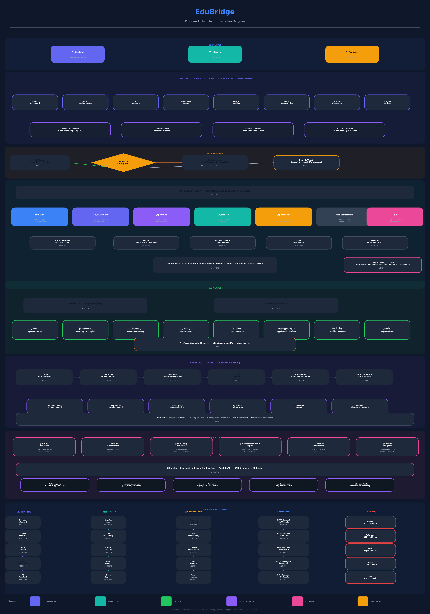

# EduBridge

**An AI-powered educational platform connecting underserved students with mentors, sponsors, and a multilingual learning community.**

---

## Architecture Flowchart



---

## Table of Contents

1. [Overview](#overview)
2. [Tech Stack](#tech-stack)
3. [Project Structure](#project-structure)
4. [Architecture](#architecture)
5. [Authentication Flow](#authentication-flow)
6. [Database Models](#database-models)
7. [API Reference](#api-reference)
8. [AI Features](#ai-features)
9. [Real-Time & Video Calls](#real-time--video-calls)
10. [User Journeys](#user-journeys)
11. [Frontend Pages & Components](#frontend-pages--components)
12. [Security](#security)
13. [Getting Started](#getting-started)
14. [Environment Variables](#environment-variables)

---

## Overview

EduBridge is a full-stack platform built for underserved students that brings together:

- **AI Study Assistant** — Gemini-powered Q&A, summarisation, and multilingual translation
- **Mentor Network** — Book one-on-one or group sessions with domain experts via WebRTC video calls
- **Sponsorship Marketplace** — Students apply for scholarships; sponsors track impact
- **Community Hub** — Real-time group messaging, topic-based forums, emoji reactions, typing indicators
- **Role-Based Access** — Separate dashboards and capabilities for Students, Mentors, and Sponsors

---

## Tech Stack

| Layer | Technology |
|-------|-----------|
| Frontend | Next.js 15, React 19, TypeScript, Tailwind CSS 4, Framer Motion, GSAP |
| Backend | Node.js, Express.js 4 |
| Database | MongoDB (Mongoose ODM) |
| Auth | Firebase Auth + JWT (hybrid) |
| Real-time | Socket.IO 4 |
| Video Calls | WebRTC + Firebase Firestore (signalling) |
| AI | Google Gemini 1.5 Flash, OpenAI (optional) |
| Forms | React Hook Form + Yup validation |
| HTTP | Axios |
| Security | Helmet, CORS, express-rate-limit, bcryptjs, express-validator |

---

## Project Structure

```
edubridge/
├── src/
│   ├── app/                        # Next.js App Router pages
│   │   ├── page.tsx                # Landing / dashboard
│   │   ├── about/
│   │   ├── features/
│   │   ├── auth/
│   │   │   ├── login/
│   │   │   ├── register/
│   │   │   ├── forgot-password/
│   │   │   └── reset-password/
│   │   ├── ai-assistant/
│   │   ├── community/
│   │   ├── mentors/
│   │   ├── sponsors/
│   │   ├── profile/
│   │   ├── student/
│   │   │   └── applications/
│   │   └── sponsor/
│   │       └── dashboard/
│   ├── components/                 # Reusable React components
│   ├── contexts/                   # React context providers
│   ├── hooks/                      # Custom hooks (useAuth, useVideoCall)
│   └── lib/
│       └── firebase.ts             # Firebase SDK init
├── backend/
│   ├── server.js                   # Express app + Socket.IO setup
│   ├── config/                     # DB connection, env config
│   ├── middleware/
│   │   └── auth.js                 # JWT verification + role guards
│   ├── models/                     # Mongoose schemas
│   │   ├── User.js
│   │   ├── MentorSession.js
│   │   ├── Message.js
│   │   ├── Group.js
│   │   ├── Forum.js
│   │   ├── Sponsor.js
│   │   ├── Notification.js
│   │   └── ...
│   └── routes/
│       ├── auth.js
│       ├── community.js
│       ├── forum.js
│       ├── mentor.js
│       ├── sponsor.js
│       ├── ai.js
│       ├── user.js
│       └── notifications.js
├── public/
│   └── architecture.png            # Architecture flowchart
├── .env.local.example
└── package.json
```

---

## Architecture

EduBridge follows a layered architecture with clear separation of concerns.

```
┌─────────────────────────────────────────────────────────┐
│                    USER LAYER                           │
│         Student  |  Mentor  |  Sponsor                  │
└───────────────────────┬─────────────────────────────────┘
                        │  HTTPS
┌───────────────────────▼─────────────────────────────────┐
│                  FRONTEND LAYER                         │
│  Next.js 15 (App Router) + React 19 + Tailwind CSS      │
│  Framer Motion animations | GSAP scroll effects         │
│  HybridAuthContext | Socket.IO client | Axios           │
└───────────────────────┬─────────────────────────────────┘
                        │  REST API + WebSocket
┌───────────────────────▼─────────────────────────────────┐
│               AUTH GATEWAY                              │
│      Firebase Auth  ──OR──  JWT (bcrypt + MongoDB)      │
│              JWT issued on both paths                   │
└───────────────────────┬─────────────────────────────────┘
                        │  Bearer token
┌───────────────────────▼─────────────────────────────────┐
│                BACKEND LAYER                            │
│  Express.js — /api/* routes                             │
│  Helmet | CORS | Rate-Limit | express-validator         │
│  Socket.IO server (real-time events)                    │
│  Google Gemini 1.5 Flash (AI routes)                    │
└────────────────┬──────────────┬───────────────────────┬─┘
                 │              │                       │
         ┌───────▼──────┐  ┌───▼──────────┐  ┌────────▼──────┐
         │   MongoDB    │  │   Firebase   │  │  Gemini API   │
         │  (Mongoose)  │  │  (Firestore) │  │  + OpenAI     │
         └──────────────┘  └─────────────┘  └───────────────┘
                             ↑ signalling
                          WebRTC video calls
```

---

## Authentication Flow

EduBridge uses a **hybrid dual-mode authentication** strategy to maximise resilience.

### Registration & Login

```
User submits credentials
        │
        ▼
Firebase configured?
   YES ──────────────► Firebase signInWithEmailAndPassword()
   │                          │
   │                    Creates Firestore doc
   │                          │
   NO ──────────────► Demo backend (MongoDB + in-memory)
                              │
                       bcryptjs (12 rounds)
                              │
                     ◄────────┴────────────
                              │
                    JWT issued (7-day expiry)
                              │
                    Stored in localStorage
                              │
                    Attached as Authorization: Bearer <token>
                    on all subsequent API requests
```

### Context Provider — `HybridAuthContext`

| State | Type | Description |
|-------|------|-------------|
| `user` | `User \| null` | Logged-in user object |
| `token` | `string \| null` | JWT for API calls |
| `isLoading` | `boolean` | Hydration/loading state |

| Method | Description |
|--------|-------------|
| `login(email, password)` | Authenticate, store token |
| `register(userData)` | Create account (Firebase → Demo fallback) |
| `logout()` | Clear state + localStorage |
| `updateProfile(data)` | PATCH `/api/auth/profile` |

### Demo Accounts

| Role | Email | Password |
|------|-------|----------|
| Student | student@demo.com | demo123 |
| Mentor | mentor@demo.com | demo123 |
| Sponsor | sponsor@demo.com | demo123 |

---

## Database Models

### User

```
email           String  (unique, indexed)
password        String  (bcrypt hashed)
name            String
userType        Enum    student | mentor | sponsor
profileImage    String
bio             String
location        { country, state, city }
languages       String[]
preferences     { theme, notifications }
communityStats  { postsCount, helpfulAnswers, reputation, badges[] }

studentProfile  {
  grade, subjects[], goals[], achievements[], progress
}

mentorProfile   {
  expertise[], experience, education[], certifications[],
  availability { days[], hours, timezone },
  rating, totalSessions, isVerified
}

sponsorProfile  {
  organizationName, type, website, focusAreas[],
  totalContributions, activeCampaigns, isVerified
}
```

### MentorSession

```
title, description
mentor          ref → User
sessionType     one-on-one | group | workshop | webinar
format          video | audio | chat | in-person
duration        Number (minutes)
scheduledDate   Date
maxParticipants Number
participants    [{ userId, status, joinedAt }]
topics[], prerequisites[], resources[]
meetingLink, roomId
recording       { url, duration, isPublic }
transcript      { content, language, aiSummary, keyPoints[] }
status          scheduled | live | completed | cancelled
feedback        [{ userId, rating, comment }]
aiInsights      { engagementScore, participationMetrics, suggestedFollowUp }
```

### Message

```
content         String (max 2000)
sender          ref → User
group           ref → Group
messageType     text | image | file | link | poll | announcement
attachments     [{ filename, url, size, mimeType }]
replyTo         embedded message
reactions       [{ emoji, users[] }]
mentions        ref[] → User
isEdited, isPinned, isDeleted
aiGenerated, aiContext
moderation      { status, flagReason, moderatedBy }
readBy          [{ userId, readAt }]
```

### Group

```
name, description
category        Career Advice | Scholarship Alerts | Study Groups | ...
createdBy       ref → User
admins          ref[] → User
members         [{ userId, joinedAt, role: member | moderator }]
settings        { isPrivate, allowFileSharing, maxMembers, autoModeration }
stats           { totalMessages, activeMembers, lastActivity }
pinnedMessages  ref[] → Message
tags            String[]
```

### ForumPost

```
title, content
author          ref → User
category, tags[], language, difficulty
views, likes[]
aiSummary, aiTags[], sentiment
status          active | closed | archived | flagged
isPinned, isFeatured
replies         ref[] → ForumReply
replyCount, lastActivity
```

### SponsorOpportunity

```
title, description
sponsor         ref → User
type            scholarship | internship | mentorship | equipment-donation | ...
budget          { amount, currency, type: fixed | per-student | range }
eligibility     { minAge, maxAge, educationLevel, location, subjects, gpaRequirement }
applicationDeadline, selectionDate
maxApplicants, selectedCount
requiredDocuments[], applicationQuestions[]
applications    [{
  applicant ref → User,
  status pending | reviewing | accepted | rejected,
  responses[], documents[], score, reviewNotes
}]
status          draft | active | closed | completed
aiRecommendations [{ userId, matchScore, reasons[] }]
```

### Notification

```
recipient       ref → User
sender          ref → User (optional)
type            new-message | application-update | mentor-invitation |
                opportunity-alert | session-reminder | ...
title, message, action
read            Boolean
actionUrl, metadata
```

---

## API Reference

### Auth — `/api/auth`

| Method | Endpoint | Auth | Description |
|--------|----------|------|-------------|
| POST | `/register` | — | Create account |
| POST | `/login` | — | Login, returns JWT |
| GET | `/profile` | JWT | Get current user |
| PUT | `/profile` | JWT | Update profile |
| PUT | `/change-password` | JWT | Change password |
| POST | `/forgot-password` | — | Send reset email |
| POST | `/reset-password` | — | Reset with token |
| POST | `/refresh` | JWT | Renew token |

### Community — `/api/community`

| Method | Endpoint | Auth | Description |
|--------|----------|------|-------------|
| GET | `/groups` | JWT | List groups (filter, paginate, search) |
| POST | `/groups` | JWT (mentor/sponsor) | Create group |
| POST | `/groups/:id/join` | JWT | Join group |
| POST | `/groups/:id/leave` | JWT | Leave group |
| GET | `/groups/:id/messages` | JWT | Fetch messages |
| POST | `/groups/:id/messages` | JWT | Send message |
| POST | `/groups/:id/messages/:msgId/reactions` | JWT | Add reaction |

### Forum — `/api/forum`

| Method | Endpoint | Auth | Description |
|--------|----------|------|-------------|
| GET | `/posts` | Optional | List posts |
| POST | `/posts` | JWT | Create post |
| GET | `/posts/:id` | Optional | Get post + replies |
| POST | `/posts/:id/replies` | JWT | Add reply |
| POST | `/posts/:id/like` | JWT | Like / unlike |
| GET | `/categories` | — | Categories with counts |

### Mentor — `/api/mentor`

| Method | Endpoint | Auth | Description |
|--------|----------|------|-------------|
| GET | `/sessions` | JWT | List sessions |
| POST | `/sessions` | JWT (mentor) | Create session |
| POST | `/sessions/:id/book` | JWT (student) | Book session |

### Sponsor — `/api/sponsor`

| Method | Endpoint | Auth | Description |
|--------|----------|------|-------------|
| GET | `/opportunities` | Optional | List opportunities |
| POST | `/opportunities` | JWT (sponsor) | Create opportunity |
| POST | `/opportunities/:id/apply` | JWT (student) | Apply |
| POST | `/opportunities/:id/applications/:appId/review` | JWT (sponsor) | Review application |

### AI — `/api/ai`

| Method | Endpoint | Auth | Description |
|--------|----------|------|-------------|
| POST | `/study-assistant` | JWT | Answer subject question |
| POST | `/summarize` | JWT | Summarise text/discussion |
| POST | `/translate` | JWT | Translate to target language |
| POST | `/recommendations` | JWT | Get personalised recommendations |
| POST | `/moderate` | JWT | Check content safety |

### Notifications — `/api/notifications`

| Method | Endpoint | Auth | Description |
|--------|----------|------|-------------|
| GET | `/` | JWT | List with pagination |
| PATCH | `/:id/read` | JWT | Mark as read |
| PATCH | `/mark-all-read` | JWT | Mark all read |
| DELETE | `/:id` | JWT | Delete notification |
| GET | `/unread-count` | JWT | Get unread count |

---

## AI Features

All AI features use **Google Gemini 1.5 Flash** with structured prompt engineering.

```
User Input
    │
    ▼
Prompt Engineering (subject, difficulty, language context injected)
    │
    ▼
Gemini 1.5 Flash API
    │
    ▼
Parsed JSON Response
    │
    ▼
UI Render / DB Store
```

### Feature Breakdown

| Feature | Endpoint | What it does |
|---------|----------|--------------|
| Study Assistant | `/ai/study-assistant` | Subject-aware Q&A with step-by-step explanations |
| Summarizer | `/ai/summarize` | Condenses forum threads, session transcripts |
| Translator | `/ai/translate` | 10+ languages, format-preserving |
| Recommendations | `/ai/recommendations` | Matches students to mentors/scholarships via profile analysis |
| Content Moderator | `/ai/moderate` | Returns `{ safe, reason, confidence }` |
| Session Analytics | (post-session) | Engagement score, participation metrics, follow-up suggestions |
| Auto-tagging | (forum) | Gemini suggests relevant tags for posts |
| Sentiment Analysis | (forum) | Determines tone and emotion of posts |

---

## Real-Time & Video Calls

### Socket.IO Events

| Event | Direction | Description |
|-------|-----------|-------------|
| `join-group` | Client → Server | Enter group room |
| `leave-group` | Client → Server | Exit group room |
| `group-message` | Bidirectional | Broadcast message to room |
| `message-reaction` | Bidirectional | Live emoji reaction |
| `typing-start` / `typing-stop` | Client → Server | Typing indicators |
| `user-online` / `user-status` | Bidirectional | Presence awareness |
| `mentor-session` | Bidirectional | Session lifecycle events |

### WebRTC Video Call Flow

```
Caller                          Firebase Firestore             Receiver
  │                                    │                          │
  ├─── sendCallInvitation() ──────────►│                          │
  │    { from, to, roomId, status }    │                          │
  │                                    ├──── onSnapshot() ────────►│
  │                                    │   incoming call detected  │
  │                                    │                          │
  │                                    │◄─── acceptCall() ────────┤
  │                                    │   status = 'accepted'    │
  │◄─── status change detected ────────┤                          │
  │                                    │                          │
  ├─── createOffer() ─────────────────►│                          │
  │    SDP offer stored in Firestore   │                          │
  │                                    ├──── createAnswer() ──────►│
  │                                    │    SDP answer stored      │
  │◄─── ICE candidates exchange ───────┼──────────────────────────┤
  │                                    │                          │
  ├══════════════ RTCPeerConnection established ══════════════════►│
  │                    Direct P2P media stream                    │
```

**STUN Servers:** `stun:stun.l.google.com:19302`, `stun:stun1.l.google.com:19302`

**Call lifecycle:**
- Calls expire automatically after **5 minutes** if unanswered
- Cleanup cron runs every **2 minutes**
- On disconnect: Firestore doc deleted, `RTCPeerConnection` torn down, media tracks stopped

**Video call controls (VideoCallModal):**

| Control | State | Description |
|---------|-------|-------------|
| Camera | `isVideoEnabled` | Toggle local video track |
| Microphone | `isAudioEnabled` | Toggle local audio track |
| Screen Share | `isScreenSharing` | Replace video with display capture |
| Duration | `callDuration` | Live call timer |
| End Call | — | Cleanup + Firestore delete |

---

## User Journeys

### Student

```
Register (student role)
    │
    ▼
Landing Dashboard — stats, recommendations, upcoming sessions
    │
    ├──► Browse Mentors → Filter by expertise/rating → Book Session → WebRTC call
    │
    ├──► Community → Join Groups → Real-time chat → Emoji reactions
    │
    ├──► Forum → Ask questions → Get mentor-verified answers
    │
    ├──► Sponsors Page → Browse scholarships → Multi-step application form
    │         └─ Applications Tracker → status: pending / reviewing / accepted
    │
    └──► AI Assistant → Ask study questions → Get multilingual explanations
```

### Mentor

```
Register (mentor role) — expertise, availability, certifications
    │
    ▼
Set Availability (days, hours, timezone)
    │
    ├──► Create Sessions (one-on-one, group, workshop, webinar)
    │         └─ Generate meeting room → Students book → WebRTC session
    │
    ├──► Create Community Groups → Invite students → Moderate discussion
    │
    ├──► Answer Forum Questions → Responses marked as "Mentor Verified"
    │
    └──► View Analytics → Session recording, transcript, AI insights, ratings
```

### Sponsor

```
Register (sponsor role) — organization, focus areas, verification
    │
    ▼
Create Opportunity (scholarship / internship / equipment donation)
    │     └─ Set budget, eligibility, deadline, application questions
    │
    ├──► Receive Applications → Review student responses, documents, scores
    │
    ├──► Select Winners → Notify applicants → Track distribution
    │
    ├──► Create Campaign → Set funding goal → Invite co-sponsors
    │
    └──► Impact Dashboard → Students helped, sessions sponsored, outcomes
```

---

## Frontend Pages & Components

### Pages

| Route | Description |
|-------|-------------|
| `/` | Hero, features, stats, CTA — or dashboard if logged in |
| `/auth/login` | Email + password login |
| `/auth/register` | Role selection + profile setup |
| `/auth/forgot-password` | Send reset link |
| `/auth/reset-password` | New password form |
| `/ai-assistant` | Gemini-powered chat interface |
| `/community` | Group list + real-time messaging |
| `/mentors` | Mentor directory + booking |
| `/sponsors` | Scholarship / opportunity listings |
| `/student/applications` | Application tracker |
| `/sponsor/dashboard` | Opportunity management for sponsors |
| `/profile` | Edit profile, preferences |
| `/features` | Platform feature overview |
| `/about` | Mission, team |

### Key Components

| Component | Purpose |
|-----------|---------|
| `Navbar` | Responsive nav, auth state, user menu |
| `HeroSection` | Animated landing hero |
| `FeaturesSection` | Platform feature cards |
| `StatsSection` | Live community metrics |
| `CTASection` | Sign-up / login prompts |
| `Footer` | Links, socials |
| `CreateGroupModal` | New group form (mentors/sponsors) |
| `CreateOpportunityModal` | Scholarship creation with budget + eligibility |
| `ApplicationModal` | 4-step student application (personal → education → experience → motivation) |
| `VideoCallModal` | WebRTC UI: camera, mic, screen share, duration |
| `VideoCallNotification` | Incoming call toast with accept/decline |
| `InterviewModal` | Pre-session preparation interface |

---

## Security

| Layer | Mechanism |
|-------|-----------|
| HTTP headers | `helmet` — XSS, clickjacking, MIME sniff protection |
| Rate limiting | `express-rate-limit` — 100 requests per 15 minutes per IP |
| CORS | Whitelist of allowed origins |
| Auth | JWT with 7-day expiry, verified on every protected route |
| Passwords | `bcryptjs` — 12 salt rounds |
| Input validation | `express-validator` on all POST/PUT routes |
| File uploads | `multer` — type and size restrictions |
| AI content | Gemini moderation on user-generated content (confidence threshold) |

---

## Getting Started

### Prerequisites

- Node.js 18+
- MongoDB (local or Atlas)
- Firebase project (optional — demo mode works without it)
- Google Gemini API key

### Frontend

```bash
cd edubridge
npm install
cp .env.local.example .env.local
# Fill in values (see Environment Variables section)
npm run dev
```

### Backend

```bash
cd edubridge/backend
npm install
cp .env.example .env
# Fill in values
node server.js
```

---

## Environment Variables

### Frontend (`.env.local`)

```env
NEXT_PUBLIC_API_URL=http://localhost:5001
NEXT_PUBLIC_FIREBASE_API_KEY=
NEXT_PUBLIC_FIREBASE_AUTH_DOMAIN=
NEXT_PUBLIC_FIREBASE_PROJECT_ID=
NEXT_PUBLIC_FIREBASE_STORAGE_BUCKET=
NEXT_PUBLIC_FIREBASE_MESSAGING_SENDER_ID=
NEXT_PUBLIC_FIREBASE_APP_ID=
```

### Backend (`.env`)

```env
PORT=5001
NODE_ENV=development
FRONTEND_URL=http://localhost:3000
MONGODB_URI=mongodb://localhost:27017/edubridge
JWT_SECRET=your_jwt_secret_here
GEMINI_API_KEY=
OPENAI_API_KEY=          # optional
```

> Firebase credentials are optional. If not provided, the app runs in demo mode with in-memory auth and MongoDB storage.
